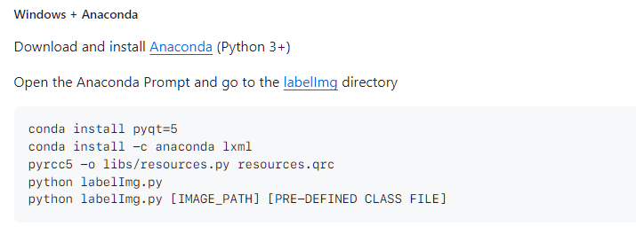

### Tools 
1. http://www.colabeler.com/

2. https://github.com/open-mmlab/labelbee

3. https://github.com/HumanSignal/labelImg
    windows + Anaconda
    

### knowledge

#### 正类别和父类别
##### 正类别
正类别（Positive Class）： 正类别是你感兴趣的类别，也是你想要模型成功识别的类别。
在某些情况下，正类别可能表示一些事件或情况的发生，比如疾病的存在、垃圾邮件等。
##### 负类别
负类别（Negative Class）： 负类别是除了正类别之外的所有其他类别。
在二分类问题中，它是模型不关心的类别，即你希望模型将样本判定为负类别的类别。

例如，在猫猫拉屎的问题中，你可能定义两个类别：

正类别（Positive Class）：猫猫拉屎的图片
负类别（Negative Class）：其他不是猫猫拉屎的图片
这里，“猫猫拉屎的图片”是你感兴趣的类别，因此它是正类别。而其他不是猫猫拉屎的图片则是负类别。

通俗的理解就是，正类别是你想要模型识别的类别，负类别是你不想要模型识别的类别。
一般而言，输出值越接近 0，表示模型越确信输入样本属于负类别；
而输出值越接近 1，表示模型越确信输入样本属于正类别。
在二分类中，通常将输出值大于 0.5 视为正类别，小于 0.5 视为负类别。
但在某些情况下，你可能需要根据具体问题调整这个阈值。